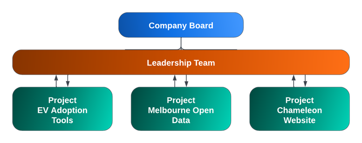

<h1 style="color:#336699; text-align: center">&emsp;&emsp;&emsp;Pass Task 6.1P</h1>

<h1 style="color:#336699; text-align: center">&emsp;&emsp;&emsp;Chameleon</h1>

<h2 style="text-align: center">&emsp;&emsp;&emsp;Table of Contents</h2>
  
<table style="width: 90%">
    <colgroup>
        <col/>
    </colgroup>
    <tr>
        <th style="text-align: center; vertical-align: middle" font-size=30><b>TABLE OF CONTENTS</b></th>
    </tr>
    <tr>
        <td style="text-align: center; vertical-align: middle;"><a href="#exec">
            EXECUTIVE SUMMARY</a></td>
    </tr>
    <tr>
        <td style="text-align: center; vertical-align: middle;"><a href="#mission">
            Our Mission</a></td>
    </tr>
    <tr>
        <td style="text-align: center; vertical-align: middle;"><a href="#structure">
            Our Structure</a></td>
    </tr>
    <tr>
        <td style="text-align: center; vertical-align: middle;"><a href="#leadership-team">
            LEADERSHIP TEAM</a></td>
    </tr>
    <tr>
        <td style="text-align: center; vertical-align: middle;"><a href="#tri-goals">
            TRIMESTER GOALS & OBJECTIVES</a></td>
    </tr>
    <tr>
        <td style="text-align: center; vertical-align: middle;"><a href="#objectives">
            Objectives</a></td>
    </tr>
    <tr>
        <td style="text-align: center; vertical-align: middle;"><a href="#company-structure">
            COMPANY STRUCTURE</a></td>
    </tr>
    <tr>
        <td style="text-align: center; vertical-align: middle;"><a href="#projects">
            PROJECTS OVERVIEW</a></td>
    </tr>
    <tr>
        <td style="text-align: center; vertical-align: middle;"><a href="#eva">
            EV Adoption Tools</a></td>
    </tr>
    <tr>
        <td style="text-align: center; vertical-align: middle;"><a href="#location">
            EV Charger Forecasting & Location Optimisation</a></td>
    </tr>
    <tr>
        <td style="text-align: center; vertical-align: middle;"><a href="#evm">
            Evoleon Mobile Application</a></td>
    </tr>
    <tr>
        <td style="text-align: center; vertical-align: middle;"><a href="#playground">
            Melbourne Open Data</a></td>
    </tr>
    <tr>
        <td style="text-align: center; vertical-align: middle;"><a href="#cham">
            Chameleon Website</a></td>
    </tr>
</table>

 
 
 
 
 
 
 
 
 
 
 
 

Prepared by Chameleon Leadership: 
    <a href="mailto:chameleon@deakin.edu.au">chameleon@deakin.edu.au 

   

 
 
 
 

<h1 style="color:#336699">Executive Summary</h1>

### OUR MISSION

Given the complexity of energy application needs today, IoT systems are being designed to address a wide variety of existing problems.

In Chameleon, our mission is to research, create, test, document and deploy IoT-based solutions to enhance life through the application of smart city technologies. Including the building of smarter cities, homes, transportation, and energy management systems.

### OUR STRUCTURE

There are currently three divisions within the company, focusing on the three key areas of strategic importance:

- Electric Vehicle (EV) Adoption Tools (EVAT)
- City of Melbourne Open Data (MOP)
- Chameleon Website (CW)

Both EVAT and MOP leverage datasets from several sources including data generated by IoT-based sensors and as such fit within the goals and mission of the company. The Chameleon website is our main online presence where we articulate who we are, what we do, and show case our projects to the world.

<h4 style="color:#336699; text-align:left;">EVAT</h4>
The EV Adoption Tools division currently has two projects underway. The first is a mobile application to help EV drivers locate and navigate to charging stations that meet the needs of their vehicles. The second uses big data to analyse the density of EV ownership, main transport routes (amongst other things) and recommends optimal locations for new EV Charging stations. 

<h4 style="color:#336699; text-align:left;">MOP</h4>
The City of Melbourne Open data division has been engaged with Melbourne City to support greater use of their Open Data library by businesses, researchers, and software developers. MOP delivers an educational portal that demonstrates how to leverage Open Data using real-world scenarios which helps Melbourne City achieve one of their key strategic goals.

<h4 style="color:#336699; text-align:left;">CW</h4>
The Chameleon Website aims to accumulate all the information about the Chameleon company overall to present in a format that is pleasantly designed, laid out, easy to navigate and useful components to display the progress of all 3 projects while outlining their goals. Which aims to provide a one-stop portal to different links and sub-projects within the company.

<h1 style="color:#336699">Leadership Team</h1>

**Acting Director:** Chathu Ranaweera.

**Company Board:** Chathu Ranaweera , Mick Wiedermann, Angie Hollingworth, Janvi Gupta.

<h4 style="color:#336699; text-align:left;">EV Adoption Tools</h4>
<b>Group Project Lead:</b> Mick Wiedermann

EV Charger Forecasting & Location Optimisation (_sub project 1)_
- Sub Project Lead Barry Chen
- Web Dev Lead: Yesini Charithma Liyanage
- Data Science Lead: Scott West & Ishika Khanna

Evoleon Mobile Application (_sub project 2_)
- Sub Project Lead: Joel Murph-Dyer & Jordan Sam Cook
- App Dev Lead: Aanan Abdullah

<h4 style="color:#336699; text-align:left;">Melbourne Open Data</h4>
<b>Project Lead:</b> Angie Hollingworth

- Data Science Leads: Vaibhav Kashyap, Vinit Karunakar, Abhishek Bajaj
- Web Development Lead: Tate Remzi-Johnson
- Security Team Lead: Izaz Ishaque

<h4 style="color:#336699; text-align:left;">Chameleon Website</h4>
<b>Project Lead:</b> Janvi Gupta

- Web Development Lead: Navin Dharamrajan & Mayank Verma
- Design Team Lead: Zak Constable
- Assistant Design Lead: Jon Suwannakoot

 
 

# <h1 style="color:#336699">Company Structure</h1>

# <h1 style="color:#336699">Trimester Goals & Objectives</h1>

### T1-2023 Objectives
Along with moving each of the Chameleon projects forward, closer to their overall goals, we have identified the following areas for improvement this trimester.

- Document a policy for creating and storing documents with a focus on storing and managing key company documents on GitHub. Once created, migrating company documents to GitHub converting them to markdown in the process.
- Document the best practice policy for the maintenance of the company’s GitHub repository, this is to include how to prepare the repository for handover at the end of the trimester. 
- Document a policy and procedure for the overall handover process for the company making it seamless for future students to take the lead. This involves:
    - Centralising credentials and resources used throughout the company.
    - Have multiple junior students (who are on lead) brought into the handover process across all projects so that the knowledge does not sit with one team, project or person.
- Introduce cross-collaboration across all projects within the company
    - Sharing teams such as design & security
    - Have multiple cross-company meetings to get all team members (especially the juniors) familiar with the company as a whole.
    - Share wins, roadblocks, resources and topics across similar teams from other projects.
- Introduce and document Cyber Security best practices, and stress tests across all projects. This will introduce future tasks that the web development teams can complete.
- Implement a Design plan across all projects that details the colour scheme to layouts to high-fidelity quality produced wireframes with quality prototyping. 

 

<h1 style="color:#336699">Projects Overview</h1>

 

<h2 style="color:#336699">EV Adoption Tools</h2>
The EV Adoption Tools project aims to drive increased adoption of Electric Vehicles (EVs) in Australia. This will help drive reduced dependence on fossil fuels, lower greenhouse gas emissions and have a positive impact on the environment and global weather events.

### EV Charger Forecasting & Location Optimisation

#### Overview
Project EVCFLO provides aid to this cause through two key services: interactive maps using Google API, and an AI Prediction System, that recommends new Electric Vehicle Charging Station (EVCS) locations which will be used effectively by the relevant population.

#### Goals & Objectives
1. Using community data to expand on our database through the addition of newly found datasets.
2. Narrow down to the key external factors which impact the usage and success of EVs and EVCSs
3. Display newly discovered EVCS locations onto a visual map.
4. Integrate new EVCS locations onto our Google API interactive map.
5. Fully migrate and host the new React based EVCFLO website.

#### Aims this Trimester
Convert the old HTML/CSS website to new website that using React framework and aim to integrate an interactive map that covers all EVCS locations across the globe to the website. Research and implement an AI Prediction System that automatically and accurately recommends new EVCS locations for EVCS companies to utilize. Further, we aim to advance the project website by implementing design work completed by previous trimesters and add more contents to the website.

#### Deliverables
- Display newly discovered EVCS locations onto a visual map (Web-Development team).
- Integrate new EVCS locations onto our Google API interactive map (Web-Development team).
- Implement website designs on the EVCFLO website and increase the sites functionality (Web-Development team).
- Fully convert the old HTML/CSS website using React framework (Web-Development team).
- Add more website contents such as FAQ page and AI Model pages (Web-Development team).
- Expand on our EV Charge Location database through the addition of new datasets. (Data Science Team)
- Continue to improve the clustering predictions, these are working but can be improved (Data Science Team).
- Create more EVCS related AI/ML models to facilitate EVCS development and promote EV adaptation (Data Science Team).
- Conduct more EV/EVCS related research and data analysis on newfound datasets (Data Science Team).
- Improve the current visualisations (Both teams).

#### Completion Summary
- Fully converted the old HTML/CSS website using React framework (Web-Development team).
- Added FAQ and AI Models web pages to the new react site.
- Reconfigure the Form elements of the website for user to add new EVCS locations.
- Updated and migrated the EV charging locations map, currently working though not yet complete.
- Conducted an extensive review of the project repository as a precursor to cleaning and updating it. 
- Updated the EVCFLO repo with new readme's and linking directories as well as new best practice documents.
- Reviewed and reorganised datasets and notebooks resources in the project GitHub Repo
- Added new EV/EVCS related datasets to the project and conduct data analysis on these data. 
- Researched and built new AI/ML models to promote EVCS development.
- Currently investigating a proper way to implement Flask for website backend and how the website can be hosted online using Google Cloud Platform.

#### EVCFLO Project Members Contributions

| **Name** | **Student_ID** | **UG/PG** | **J/S** | **Team** | **Lead** | **Achievements** |
| :-- | :-- | :-: | :-: | :-: | :-: | :--
| **Mick Wiedermann** | 222058299 | Undergrad | Senior | Project | Yes | Within EVCFLO I organise and host the weekly meetings, record minutes, support and help organise the team. Created the current trello board (previous board was seperate to Chameleon), created Chameleon onboarding checklist and sprint planning documents. Note, I contribute to Evoleon App not technically.|  
| **Scott Geoffrey West** | 213121254 | Postgrad | Junior | Data Science | Co.|I have assisted with creating the "Data Science - Getting Started & Upskilling folder", and pro-actively completed project management tasks using through Trello, organizing meetings and communicating in Microsoft Teams. I have also built & completed EDA & ML models on EV charging stations around the world. In doing so I created charts & reports (eg pie, bar & heat maps) to uncover insights & committed these to Github (please note this is still a work in progress).|
| **Jamie Connor Davidson** | 222356461 | Postgrad | Junior | Data Science |  |On the Data Science Team, I have written and completed Trello card items, attended weekly team meeting to update my progress, created a file structure, naming convention, reference and workflow and readme files for the EVCFLO/datasets. I have been working on creating datasets and notebooks to improve the way we perform data analysis, and prepare data for modelling.|
| **Siqin Chen** | 221115918 | Postgrad | Senior | Data Science |  |conducted extensive research on the topic of electric vehicle (EV) range, ensuring a thorough understanding of its definition and various types; gathered data on the EV range of popular models available in the market; utilized Python to create a script for cleaning the dataset and visualize it; compiled a comprehensive document to detail the dataset and analyze the results.|
| **Viola Cherotich Meli** | 221187491 | Postgrad | Senior | Data Science |  |conducted research on EV, in melbourne, my user story was on determining the wait time per charging station, in the first sprint I have been able to use the already collected dataset since i found most of them that were collected last trimester more suitable for my case..I did alot of data cleaning and EDA using python and uploaded a comprehensive document on the same. In this second sprint am working on implementing machine learning models that would be used on predicting the wait time.|
| **Chaoyi (Barry) Chen** | 220358865 | Postgrad | Junior | Web Dev, Project | Yes |Being the project lead, I have co-hosted weekly team meeting and written minutes, assisted on broken down user stories into actionable Trello card items, organise and properly setup Trello board, reviewed and organised GitHub resources, facilitate team communication and operation. I have reviewed and provided summary report of all data analysis, AI/ML models that have built for the project to support Data science team, and I have also built AI models webpage and added contents based on React framework as Web Dev member of the team.|
| **Ishika Khanna** | 219551957 | Undergrad | Junior | Web Dev | Yes |  |
| **Arnold Prabudda Kalpesh Mendis** | 222330109 | Undergrad | Junior | Web Dev |  |As an active member of the web dev team, I have prepared several user stories such as a chatbot and a submission form that will help to achieve a better outcome through our EVCFLO website. Furthermore, I have fully developed a user submission form using React JS frontend technology, which helps us to insert records into our company database regarding the required EV charging stations in specific areas.|
| **Mark Justin Premier** | 222115089 | Postgrad | Junior | Web Dev |  |Being a member of the frontend web dev team, I implemented the React framework to create a new and more functional frontend of the website, and migrated across most of the work from the previous website into the new website. I've also been helping other team members understand the React framework, so we all can contribute.|
| **Yousef Ashraf Y A Al-Mulla** | 221410734 | Undergrad | Junior | Web Dev |  | I created a webpage containing details of the different electric chargers offered by the company, The different products are suitable for different users. I created the webpage using react and I uploaded the same to GITHUB.I am now creating webpages containing different products and their installation suitable for different areas like workplaces, retail markets etc.|
| **Ezekiel Kevin Griffin** | 219272783 | Undergrad | Senior | Web Dev | |Created multiple report documents outlining and breaking down the purpose of previous trimesters work for teams understanding. Reacquired access to both GCP and MongoDB assets and begun documentation. As well as beginning new React/Flask integration on GCP.|
| **Yesini Charithma Liyanage** | 222063923 | Undergrad | Junior | Web Dev | Yes |As the Web Dev team lead, I have contributed in leadership and team meetings, assisted in forming user stories and functional and non-functional requirements, facilitated team communication and provided guidance to team members. I have built a README file for the project repository that summarizes all installation instructions, documentation, and project tech involved, and I am currently spearheading the web design components by creating Figma prototypes for the frontend.|

### Evoleon Mobile Application

#### Overview
The Evoleon App will help EV owners better plan their trips by identifying optimal EV charging stations as waypoints on their journey and provide them relevant information about those charging stations. 

#### Goals & Objectives
The goal of this project is to be able to design and implement a mobile app (Android and IOS) to help consumers identify nearby charging locations. Although there are existing products that are similar, here are a few examples of what the app may offer in addition to the core function of locating a socket: 
- Providing additional information and filtering of stations based on type (EV vs hydrogen, for example), information on the source of the power (direct solar, grid powered, gas, diesel etc).
- Providing a full journey planner for longer trips that optimizes for reducing charge time, cost and environmental impact along the route. 
- Ability to incorporate your usage data with current fuel prices, cost of maintenance etc and provide an indication of real savings for running the vehicle. 

#### Aims this Trimester
The aim this trimester is to continue implementing the designs created by previous teams and increase the applications functionality. A basic version of the app is currently working but it only has a few screens implemented and the functionality is very limited. Furthermore, the team aims to implement policies for shared coding practices to provide future teams with detailed references.

#### Deliverables
- Work on adding real EV Location data into the new Firestore locations database.
- Create a Navigation System for the applications map to travel to a selected EV Charger.
- Add an option to filter EV chargers on the map based on amenities stored in database for that EV charging location.
- Move the hamburger menu from the top left of the screen to a menu at the bottom of the screen, similar to the Figma designs.
- Complete a cyber security review of the app’s authentication process, data storage, code in GitHub repository, and apps terms and conditions.
- Add the process to reset a user’s password or delete an account.
- Continue adding user interface code for the applications pages.

#### Current Progress
The team has created a significant number of user stories, and team members have divided up the user stories into individual tasks. Majority of the team is focusing on the application development while a small portion of the team is focusing on enhancing the current design plans to align them more with the branding guidelines. The list below outlines the team's main achievements so far:

- Completed security review of Firestore database to ensure user details are not compromised.
- Implemented "About" Screen providing an overview of the application.
- Implemented functionality to update the application's version.
- Implemented "Terms and Conditions" Screen.
- Created password reset functionalities allowing users to reset their passwords if required.
- Implemented "User Details Update" Screen that allows users to change their personal details.
- Created a central Documents directory within the GitHub Repository and began adding policy documents in markdown.
- Updated GitHub repo readme to include a linking directory to the new policy documents. 

#### Next Steps
The team will continue to implement code for additional user interface pages along with adding user authentication functionalities. Furthermore, the team will focus on consolidating current achievements to form a plan for the handover process to ensure future teams have all the necessary information to continue working on the project.

 
 
 

#### Evoleon App Project Members

| **Name** | **Student ID** | **UG/PG** | **J/S** | **Team** | **Lead** | **Achievements** |
| :-- | :-- | :-: | :-: | :-: | :-: | :-- |
| **Mick Wiedermann** | 222058299 | Undergrad | Senior | App Dev, Project | Yes |Updated the Evoleon GitHub repo merging and resolving resulting conflicts before cloning to Chameleon (was separate). Created the current trello board (previous board was seperate to Chameleon). Created sprint planning documents and held sprint planning meetings. Added new features to the Evoleon App including the new About screen. Revamped the Chameleon Documents repo with a detailed read me and linking directory. Created Chameleon wide GitHub best practice policy. Created other how to and best practice documents, organise and host weekly meetings, mentored and guided team members.|
| **Joel Murphy-Dyer** | 221081809 | Undergrad | Junior | App Dev, Project | Yes | As a project lead for the application development team, I have implemented and coded a terms and conditions page to the app within the signup screen. Additionally, I have maintained regular contact with the team members on how they are progressing with their work.  |
| **Jordan Sam Cooke** | 220208777 | Undergrad | Junior | App Dev |Co.|Added features which include password reset and data deletion of firebase data. Working on refactoring the repository with new guidelines documents that I'm the lead developer of; in order to facilitate handover of codebase to new Chameleon members.|
| **Kanishk Rajvanshi** | 222486026 | Postgrad | Junior | App Dev |  |Being a member of the Chameleon Evoleon App Team I worked on refactoring the code to make code more efficient. Have also added relevant comments in the code for better readability. Apart from this have done refactoring of the code following the coding practice document prepared by my colleagues.|
| **Khanh Nguyen Nguyen** | 221393506 | Undergrad | Junior | App Dev |  |   |
| **Mohammed Khalid M J Al-Malki** | 220499349 | Undergrad | Junior | App Dev |  |I'm in charge of charging status part. To complete this mission, I start writing coding to carry out a future in order to show the current charging status. I've done some tests on coding and they are still getting some errors to exporting the best result. And i am attending meetings with my teammates and collaborating with them to find solutions and new ideas for our project.|
| **Rodney Tenzin Tsewang Annand** | 221156479 | Undergrad | Junior | App Dev |  |Redesigning the Map view and adding cross platform functionality to it. Adding security rules to the google firebase. General tidy up of the code base. Update conflicting dependancies. Help team members when I can.|
| **Wei Liang Tiew** | 220427347 | Undergrad | Junior | App Dev, Design |  |Created a FAQ page for the website, still further work required. Participate in the weekly meetings contibuting to the general discussion and helping team members where I can. |
| **Aanan Abdullah** | 220499062 | Undergrad | Junior | App Dev | Yes | As part of the application development team, I implemented the code for a update user details screen where users can change their personal details as necessary. Moreover, as the application development leader, I have been providing guidance to other team members to understand how to breakdown the user stories and assign any necessary tasks. |
| **Asher Lam** | 221254112 | Undergrad | Junior | Web Dev |  |I am under the app development team, my contribution so far has been researching methods on implement my design on availability on charging station and beginning design elements in figma prototypes|

<h2 style="color:#336699">Melbourne Open Data</h2>

#### Overview

The City of Melbourne has been an Australian leader in Open Data since 2014. The City of Melbourne initiated this project with Deakin to support greater use of their Open Data by businesses, researchers, and software developers. Open Data is a component of their smart cities' strategy.

#### Goals & Objectives

This project entails the development of an educational platform that showcases the practical applications of Open Data, specifically designed to cater to the needs of various stakeholders, such as industry professionals, government entities, and academic researchers. The primary objective of this project is to leverage the utilisation of the City of Melbourne's Open Data.

The long-term goal is to data useage, facilitating innovative and informed solutions to contemporary challenges across the City of Melbourne council area.

#### Aims this Trimester

The initial main focus is to read the documentation for the new API for the Melbourne Open Data Playground, and systematically work through each published (and yet to be published) notebooks and modify the code so that they will run if downloaded.

The aim for the Data Science team is to create a new set of use cases that fit within the 3 defined key areas of interest from the City Of Melbourne. The team is planning to complete a full set of use cases, and also have enough in the backlog for the next trimester when students will be focussed on InnoFes.

The web team is aiming to further streamline the processes for which the notebooks are published, and working with the design team to optimise the device browsing of our website. As part of the approach to the website, the cyber security team will also be scrutinising all apsects of our public-facing site to look for areas of vunerabilities that will need to be rectified.
The other main focus for the leadership is to document and streamline the way that the project is documented for handover at the end of each trimester.

#### Deliverables

- Update the API on all published notebooks (ready to be published again), and notebooks ready for publishing.
- Implement a human-readable URL
- Identify vulnerabilities in the source code, python code and database then document a roadmap to mitigatethem
- Implement mobile views for the website
- Complete analysis on multiple use cases (ready for publishing)
- Create multiple new use cases, allowing enough in the backlog for the next trimester
- Publish notebooks that are ready to be published
- Cleaner resources for the handover procedures for MOP
- Add more functionality to the website
- Implement some interactivity with JavaScript
- Fix the lingering deisgn / css issues within the website

#### Current Progress
The Data Science team has successfully completed repointing some of the APIs for the completed use cases ready to be republished, and also developed new use case ideas and started coding them up in jupyter.  The Cyber Security team have found vunerabilities, and are continuously documenting how the various approaches have been approached, as well ashow should be approached for when transferring the team to the other Chameleon projects. The Web Dev team have worked on making the styling for the published use cases match the over all theme, published backlog use cases and have been working on the mobile functionality for the website. The web team and design team have also been liaising for the next steps to integrate the team designs.

The list below outlines the team's main achievements so far:

- Completed repointing some of the published use case APIs.
- Completed defining a series of use cases to be explored by the DS team.
- Presented new use case ideas to the client at the City Of Melbourne.
- The source code has been inspected for vulnerabilities.
- Ports for the website have been scanned (5 open ports).
- The website has been stress tested for high amounts of traffic in small periods of time.
- Traversal attacks have been tested and do fail against the website.

#### Next Steps
The Data Science team will be completing the sprint 1 use case explorations and API repointing this current sprint, with everyone moving on to the next lot of use cases (or API repointing). The team will also be running another use case ideation workshop to create another series of use case stories to build more of a backlog.
The Security team will be focusing on implementing different types of attacks with different software to ensure vulnerabilities can be exposed allowing the Web Dev team to implement measures that will either prevent or stop these attacks as they happen. Members of the security team will also provide recommendations on any vulnerability that they do find. The web development team will be obtaining a new domain name for the website and also ensuring that the MOP website can access any relevant datasets using API links. 

#### Project Members

| **Name** | **Student ID** | **UG/PG** | **J/S** | **Team** | **Lead** | **Achievements** |
| :-- | :-- | :-: | :-: | :-: | :-: | :-- |
| **Angie Hollingworth** | 222053804 | Undergrad | Senior | Data Science, Security, Board | Yes | I created and presented the Project Pitch for the juniors,  ran a workshop on working with APIs in python / Jupyter, defined the project scope for the Security Team, worked with the Dev Lead to ideate project ideas for the team, created a file for use case ideation for the Data Science team and walked them through it, ran the client presentation (with Remi from the City of Melbourne), ran a brainstorming workshop to generate use cases with the DS leads then presented them to the broader team, set up all Trello and created all the use case cards, worked on repointing 2 APIs and set up documentation for various aspects of the project. |
| **Abhishek Bajaj** | 221034312 | Undergrad | Junior | Data Science | Yes | I have brainstormed new use cases to use from the datasets available in the City of Melbourne website with other leadership members, worked on repointing an API path for the project "new business location" (already published use case) with STEVEN NGUYEN and also started working on the new use case which records the performance of Melbourne against different Australia's fast growing municipalities with VAIBHAV KASHYAP. |
| **Vaibhav Kashyap** | 220641102 | Undergrad | Junior | Data Science | Yes | I have brainstormed new use cases to use from the datasets available in the City of Melbourne website with other leadership members and working on new API to record the performance of Melbourne against different Australia's fast growing municipalities with ABHISHEK BAJAJ. |
| **Vinit Karunakar Shetty** | 221426969 | Undergrad | Senior | Data Science | Yes |  |
| **Kruthi Shetty** | 222067974 | Postgrad | Junior | Data Science |  |  |
| **Keefe Euler Alpay** | 221243463 | Undergrad | Junior | Data Science |  |  |
| **Nathan Graham Clee** | 221255235 | Undergrad | Junior | Data Science |  | I have set up APIs to gather information about foot traffic and locations of live events to find if events affect the foot traffic. I have coded graphs shows this with the MCG and other location of live events.  |
| **Shanuk Julian Devamulla** | 221159324 | Undergrad | Junior | Data Science |  |  I have developed a new API for the pedestrian traffic analysis use case which analyzes pedestrian traffic and sensor data in the Melbourne CBD. Pedestrian function is still a work in progress but sensor API is complete. |
| **Siyu Ai** | 223008124 | Postgrad | Junior | Data Science |  | I have set up a new use case UHI (Urban heat Island) effect reduction. Data sets for data analysis were selected and data extraction was performed. |
| **Steven Nguyen** | 222337088 | Undergrad | Junior | Data Science |  | Working with ABHISHEK BAJAJ on updating the API path for the project "new business location" (already pushed use case) and currently working on the new use case Transport and Safety use case "population and accident" about car accidents hotspots in the cbd with pedestrians.  |
| **Adam James Bullivant** | 219274937 | Undergrad | Senior | Data Science |  | I am a member of the Chameleon MOP Data Science team, and during this time I have repointed x2 APIs to fix existing use cases. I have also started working on a new use case for disability services. So far, x3 datasets have been imported and currently visualise the services around the City of Melbourne. |
| **Andrew Tilling** | 220554762 | Postgrad | Senior | Data Science |  | I have repointed the API for the greening of buildings existing use case to GitHub.  Contributed to team meetings and continuing to work with the datasets to recreate the use case |
| **Tuan Minh Vu** | 219595908 | Undergrad | Senior | Data Science |  | I have learned to develop a new API for St Kilda new bikelane road. I have analyzed and integrated key concepts and new data from the City of Melbourne to ensure that the new API was developed with maximum efficiency and effectiveness in mind. So that the new API can be used to optimize bikers' routes and provide real-time information on traffic, weather, and other important factors. |
| **Amy Tran** | 213358131 | Undergrad | Junior | Data Science | | I have gathered data from City of Melbourne Open Data through API call, to create a heatmap that showcases the projection of energy consumption across Melbourne city. Energy consumption has an impact on the surrounding air temperature. The heatmap is supposed to help urban planners identify and prioritize locations for greening work. |
| **Tate Remzi-Johnson** | 221484111 | Undergrad | Senior | Dev Team | Yes | I have been leading the MOP Web Development team, providing assistance where needed to team members. I have also been working on technical documentation for the MOP web development team, and have finished a new guide for the publishing of use cases, which was a long task to be done each trimester but not well documented. |
| **Jiahao Pan** | 218562599 | Postgrad | Junior | Dev Team |  | Working in a group which is going to fix old design on previous user cases pages. I have fixed three user cases pages and make sure these follow up the newest design. |
| **Mihili Isurika Geeganage Geeganagama Arachchige** | 222398483 | Undergrad | Junior | Dev Team |  | I am a member of the fixings old page designs group. Now I am working with three pages. They are event- distruption, greenroof and Ideal green wall location identification. I change their css and designed those pages to have good look. |
| **Roshan Jose** | 221499484 | Postgrad | Junior | Dev Team |  | I am on the web development design team and was assigned to the updating the mobile view group for fixing some general, scaling issues and navigation bar. It's a work still in progress. |
| **Syed Kareemullah** | 220462373 | Undergrad | Junior | Dev Team |  | I was in a group to fix the Old designs so I reviewed three user cases ( Parking Availability , Bicycle networks and Road safety Part 1, Bicycle networks and Road Safety Part 2) and fixed their designs to make them more consistent and appealing. |
| **Muhammed Nihal** | 221461233 | Postgrad | Junior | Dev Team |  | Working with the homepage redesign team. Fixing the API call. It's a work in progress. |
| **Matthew Hall** | 220236048 | Undergrad | Senior | Dev Team |  | I have worked on developing the navigation bar and fixing issues relating web development. Worked on Trello, getting in contact with the team, and solving problems from the deliverable.  |
| **Pramodya Sathsarani Senanayaka Jayasundara Senanayaka** | 221308586 | Postgrad | Senior | Dev Team |  |  |
| **Sharini Mahisha De Mel** | 217425821 | Undergrad | Senior | Dev Team |  | I was in a group to fix the navigation bar for mobile views, scaling issues and general fixes . And solving problems from deliverables. |
| **Izaz Ishaque** | 221005704 | Undergrad | Junior | Cyber Security | Yes |  I have stress tested the website using siege to simulate how many concurrent users can access the web page at once before it becomes unusable (The website will start to fail at a rate of 50% when there are roughly 10000 users simultaneously using it). I have also  been using different tools to analyze the website and have found out that the website is using an outdated javascript library which could leave it vulnerable to further attacks. |
| **Lucas Kocon** | 218510242 | Undergrad | Junior | Cyber Security |  |  In the first sprint I contributed to the project by inspecting the website's source code for security vulnerabilities. I had found the cause for its vulnerability to well-known security attacks with its lax content security policy, as well as finding credentials written and shared in plaintext. |
| **Zachary Max Kein** | 220277143 | Undergrad | Junior | Cyber Security |  | Discovered various open TCP and UDP ports on the MOP web app and created documentation that describes how to fix the issues and ways to bolster the security of the website. |

## <h2 style="color:#336699">Chameleon Website</h2>

#### Overview

The website for the Chameleon company overall aims to publicise the achievements and progress of Chameleon overall and showcase the sub-companies within it, one of the best ways to do this is through a website. 

#### Goals & Objectives

The main objectives of this website is to provide a one-stop for all – where it includes all the other sub-companies’ infortmation, objectives and links. We want to be able to use this website to advocate for the company, and be able to promote it while having the website be visually appealing, and comes with easy functionality.

#### Aims this Trimester

The aim for this trimester will be to modify the front-end and the back-end of the website majority, and make it optimised for mobile access. While the backend hasn’t been implemented, it means we have a lot of scope to implement this from scratch. This includes setting up the staff log-in portal, implementing API’s with SendGrid and Mailchimp and creating a client portal.

For the front-end of the website, we aim to make the website more appealing, with the design and web development skills of the students. We want to deliver a high-quality attrractive, easy to navigate and overall simple aesthetic of the website. This also means through using correct wireframing techniques within the design team, agreeing on a solid design that meets this criteria before implementing.

It will be imporant for the Chameleon Website to present all the other projects for the Chameleon company on the website, while this has currently been started – links have not been provided. 

Overall, reducing awkwardness on the website and providing a smooth experience is the overall aim for this trimester. 

#### Web Dev Team Progress 
This trimester, we have researched on databases so that they can be implemented within our user login pages, and along with this how API's can be used to implement this within our website. We focused on making our website more intuative and interactive for users, and created a SRS use cases document to continue using throughout the trimester. Additionally we also analysed for SEO startegy works so our website can be presented higher on a search engine. As the research has now been compiled, we plan to start changing the website and coding in the backend API's.

#### Web Dev Team Design 
The design team have developed low-fidelity designs, as well as produce high-fidelity designs for all pages of the Chameleon website. Researching and testing various colour schemes to create more modernised look with light and dark variations of the website. Research into the redevelopment of the Chameleon 'Resources' page has also identified the potential implementation of an event calendar to showcase company related events, FAQ and emerging IoT technologies. Development of low-fidelity page designs the EV Adoption Tools website has begun and the Evoleon mobile application is undergoing a redesign with the collaboration of the EV Adoption Tools web development team.

The achievements so far can be seen in the list below:
- Completed research on database in the case of user login
- Use cases document has been created to help students analyse functionalities of the website
- API research on Sendgrid and MailChimp
- Designs being completed for majority of the website; lo-fi and hi-fi
- User personas have been created for all 3 websites

#### Next Steps
The next steps for the remainder of this trimester is to update the frontend code of the website to match the designs as produced by he design team, as well as work on the backend user signing in database and login setup and having this be functional. We also plan to implement a pop up notifcation subscriber method for users. Through the changes by the design team we have analysed the interaction of the website and how realisitic it will be for users. The design team will focus on working with the EV and MOP teams and their respective web development team leaders to begin design work for their websites and mobile applications. 

#### Deliverables

- Implement a more aesthetic and navigation friendly design
- Work on the blogging section of the website – add links to other projects
- Build the staff portal and implement the API’s behind it to get it running
- Reevaluate the Resources tab to see what can be added and removed from it
- Work on the fonts used and colour scheme of the website, and adding in different components to the website design
- Implement mobile views for the website
- Implement SEO strategy to rank the website higher in web search engines
- Building a client user account portal to view progress, updates and services of the Chameleon Projects

#### Project Members

| **Name** | **Student ID** | **UG/PG** | **J/S** | **Team** | **Lead** | **Achievements** |
| :-- | :-- | :-: | :-: | :-: | :-: | :-: |
| **Janvi Gupta** | 221220324 | Undergrad | Senior | Project Lead, Board | Yes | Being the team leader, i kept the Trello board up-to date, hosted and compelted meeting minutes, helped did the lo-fi and hi-fi designs for design team, researched the web dev team related work. |
| **Navin Dharmarajan** | 222475715 | Post Grad | Junior | Dev Team | Yes | My recent accomplishments on the Chameleon website project include creating a mono repo for the project, which contains both the frontend and backend apps, making it easier to manage and deploy. I also added sample codes for API creation and React pages with responsive design, and connected the created API to the React app, ensuring seamless integration between the frontend and backend. Furthermore, I prepared a detailed Readme doc for the Chameleon website, providing clear instructions on how to set up and use the project. In addition, I, along with Jhanvi and Mayank, created the initial SRS and Database design documents that formed the foundation of the project requirements and database structure. We also added use cases to further clarify and define the project's needs. Moreover, I made an announcement in the team about a new git update and reviewed documents created by other team members. I have attended all squad meetings.
| **Davinderjit Singh** | 219606745 | Undergrad | Junior | Dev Team |  | Researched on the resource page, research on SEO strategy and important keywords for search engine optimization, re-designed the chameleon profile page (low-fi and hi-fi) |
| **Antony Raju** | 221471405 | Post Grad | Junior | Dev Team |  | I am on the development team and i have done a research on the Search Engine Optimization. I have submitted my research about how to implement new SEO strategies and what all keywords can be used to increase the ranking of the Chameleon Website. |
| **Bhavika Sood** | 218529556 | Undergrad | Junior | Dev Team |  |  researched on what features can be included on the home page of website and how could these be  incorporated and also worked on website code for progress of project. |
| **Jordan Reeves** | 217140954 | Undergrad | Junior | Dev Team |  | So far my contributions for the team have been developing a functioning account and registration portal using firebase, implementing a database using FireStore and a creating tool for building and interacting with a local SQL database using python |
| **Seung Hwan Kim** | 221393121 | Undergrad | Junior | Dev Team |  |
| **Zhuo Yu Li** | 220283605 | Undergrad | Junior | Dev Team |  | Contribution-Collaborated with team members to complete some tasks. API research on MailChimp and provided some sample code. Research on API port and provided some sample code about how to connect to the database of MYSQL and Firebase Realtime Database. |
| **Ziyan Zhai** | 221208796 | Undergrad | Junior | Dev Team |  | Research on API socket which include the coding sample of MySQL & Firebase. Provide another research report on Mailchimp cooperating with a group member together. |
| **Aishwarya Mariselvam** | 221200552 | Post Grad | Senior | Dev Team |  |
| **Aye Moh Moh Shwe** | 220462239 | Undergrad | Senior | Dev Team |  |
| **Jiankun Wang** | 221092755 | Undergrad | Senior | Dev Team |  |Do the research on SendGrid and MailChimp,Learn the relevant knowledge. A user guide report was written, ready to put this knowledge into the future of the website construction work. To provide feasible solutions for the additional features of the homepage in website, to write a guideline report, |
| **Mathew Ho** | 220271708 | Undergrad | Senior | Dev Team |  |
| **Mayank Verma** | 219400263 | Undergrad | Senior | Dev Team | Yes | Being a Co-assistant web dev lead I have helped the leaders and team member. I made the research document on database on staff login portal, Then I have made the Gith Hub guide for all the members also I have worked with Janvi and Navin in preparing the SRS document for the website, made technical contribution with the design team in their mobile app high fi designs. Also worked with other leaders in the powerpoint presentation. I also made the website theme creation document document for developer they can pick one and start developing according to that |
| **Qiushi Huang** | 221456822 | Undergrad | Senior | Dev Team |  |
| **Regan Tam** | 219488177 | Undergrad | Senior | Dev Team |  | Conducted research in SEO strategies to help find solutions in improving Chameleons search engine visibility, along with research in the backend process with implementing a newsletter subscriber function. |
| **Thomas Koutsaplis** | 220233577 | Undergrad | Senior | Dev Team |  | Conducted research on the features, advantages, and disadvantages of both MailChimp and SendGrid email APIs. I summarised the research in the form of a report where I clearly presented and explained which API provider is best suited for Chameleon based on their needs, taking into account other factors such as potential financial budgets and the abilities of team members to implement more advanced API features. |
| **Amal Paul** | 222197619 | Undergrad | Junior | Dev team |  |  I am under Database team and researched strategy to adding tables, research on functionalities and  solutions for the chameleon team.  I been looking into team for more to contributions form my side.  |
| **Balapuwaduge Arnold Pranudda Kalpesh** | 222330109 | Undergrad | Junior | Dev Team |  |  |
| **Jiankun Wang** | 221092755 | Undergrad | Senior | Dev Team |  | Do the research on SendGrid and MailChimp,Learn the relevant knowledge,A user guide report was written， ready to put this knowledge into the future of the website construction work. To provide feasible solutions for the additional features of the homepage in website, to write a guideline report. |
| **Rodney Tenzin Teswang** | 221156479 | Undergrad | Junior | Dev Team |  |  |
| **Jon Suwannakoot** | 220069966 | Undergrad | Junior | Design Team | Yes | Created 6 User Personas for EV, Chameleon and MOP Projects. Helped with editing/submitting the document for Task 2.1P for Junior students. Created the Figma document on how to add the Template and uploaded it to GitHub. Created PNG files of the Chameleon Website Logo. Also, I made the Low-fidelity and Hi-fidelity design of the Chameleon website: Blog, Homepage, Resource pages (Event Calendar, FAQ and Emerging Technology) and Progress of our projects. Finally, I presented the Chameleon Website project in Week 5. |
| **Zak Constable** | 220535629 | Undergrad | Senior | Design Team | Yes | As the design team leader I centralised all Chameleon company figma designs, centralised all design documentation in appropriate Git repositories, created a design team information guide to improve onboarding efficiency, provide feedback and guidance to team members and assist expanding Trello backlog. Technical contributions include, developing a design information board for each project design, create design components and begin work on redevelopment of the Evoleon mobile app design and prototyping. |
| **Yin Chak Yiu** | 219352934 | Undergrad | Senior | Design Team |  |  |
| **Ziyan Shen** | 219323496 | Undergrad | Senior | Design Team |  | Being a member of the Chameleon Design Team I have created low fidelity and high fidelity designs of the about Home page, Also Low-fi of Design mobile version of the website Resource for Chameleon website with their own light and dark themes. Doing one more page of blog low fi design. Discuss with the group on time to determine the design direction, and communicate in a timely manner when there are uncertain design issues. |
| **Nitin Singh Dogra** | 221265784 | Undergrad | Junior | Design Team |  | Being a member of the Chameleon Design Team I have created low fidelity and high fidelity designs of the about us page, login page, and portfolio page for the Chameleon website with their own light and dark themes. Additionally, I have also created mobile version designs of the pages along with a design for an extended hamburger menu. |
